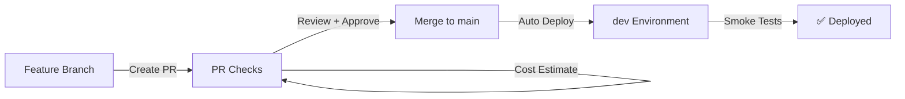
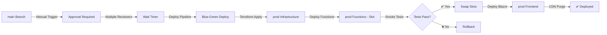

# GitHub Actions Workflow Strategy

## Overview

This document describes the complete CI/CD workflow strategy for the Azure Serverless Starter project, including automated triggers, manual approvals, and branch protection rules.

## Branch Strategy

### Protected Branches

- **`main`**: Production-ready code, protected with required PR reviews and status checks
- **`develop`**: Integration branch for feature development (optional)
- **Feature branches**: `feature/*`, `bugfix/*`, `hotfix/*`

### Branch Protection Rules

#### Main Branch
- ✅ Require pull request reviews (1 approver)
- ✅ Require status checks to pass:
  - `Terraform Plan - dev`
  - `Security Scan / code-security`
  - `Security Scan / infrastructure-security`
- ✅ Require conversation resolution before merging
- ✅ Require linear history (squash or rebase)
- ⚠️ Do not allow force pushes
- ⚠️ Do not allow deletions

#### Develop Branch (Optional)
- ✅ Require status checks to pass
- ✅ Allow squash merging
- ⚠️ Do not allow force pushes

## Workflow Triggers Matrix

| Workflow | PR to main | PR to develop | Push to main | Push to develop | Manual | Schedule |
|----------|------------|---------------|--------------|-----------------|--------|----------|
| **Terraform Plan** | ✅ (dev only) | ✅ (dev only) | ❌ | ❌ | ✅ (any env) | ❌ |
| **Terraform Apply** | ❌ | ❌ | ✅ (dev only) | ❌ | ✅ (any env) | ❌ |
| **Deploy Functions** | ❌ | ❌ | ✅ (dev only) | ❌ | ✅ (any env) | ❌ |
| **Deploy Blazor** | ❌ | ❌ | ✅ (dev only) | ❌ | ✅ (any env) | ❌ |
| **Security Scan** | ✅ | ✅ | ✅ | ✅ | ✅ | ✅ (weekly) |
| **Cost Estimation** | ✅ (if infra) | ✅ (if infra) | ❌ | ❌ | ✅ | ❌ |

## Workflow Details

### 1. Terraform Plan (`terraform-plan.yml`)

**Purpose**: Validate infrastructure changes before merge

**Triggers**:
- 🔄 **Pull Request** to `main` or `develop`:
  - When: Changes in `infrastructure/**` or workflow files
  - Action: Plan only `dev` environment
  - Required: Must pass for PR merge
- 🖱️ **Manual Dispatch**:
  - Choose environment: dev, staging, or prod
  - Use case: Validate staging/prod before deployment

**Environment Strategy**:
- PRs → Plan `dev` only (fast feedback)
- Manual → Plan selected environment

**Example Usage**:
```bash
# Automatic: Create PR with infrastructure changes
gh pr create --title "feat: add redis cache" --body "..."

# Manual: Plan staging environment
gh workflow run "Terraform Plan" --ref main -f environment=staging
```

---

### 2. Terraform Apply (`terraform-apply.yml`)

**Purpose**: Deploy infrastructure changes to Azure

**Triggers**:
- 🚀 **Push to `main`**:
  - When: Changes in `infrastructure/**`
  - Action: Auto-deploy to `dev` environment only
  - Protection: None (dev is safe for experimentation)
- 🖱️ **Manual Dispatch**:
  - Choose environment: dev, staging, or prod
  - Protection: staging/prod require **environment approvals** (configured in GitHub)

**Environment Strategy**:
- `dev` → Auto-deploy on merge (no approval)
- `staging` → Manual trigger + approval required
- `prod` → Manual trigger + approval required

**Example Usage**:
```bash
# Automatic: Merge PR to main (auto-deploys to dev)
gh pr merge 123 --squash

# Manual: Deploy to production (requires approval)
gh workflow run "Terraform Apply" --ref main -f environment=prod
```

**GitHub Environment Setup**:
```bash
# Required: Configure environment protection rules in GitHub
# Settings → Environments → [staging/prod] → Protection rules:
# ✅ Required reviewers (1-6 people)
# ✅ Wait timer (optional, e.g., 5 minutes)
# ✅ Deployment branches: main only
```

---

### 3. Deploy Azure Functions (`deploy-functions.yml`)

**Purpose**: Build and deploy Function Apps (AuthService, ProductService)

**Triggers**:
- 🚀 **Push to `main`**:
  - When: Changes in `src/AuthService/**`, `src/ProductService/**`, or `src/Shared/**`
  - Action: Auto-deploy to `dev` Function Apps
  - Post-deploy: Smoke tests (health checks)
- 🖱️ **Manual Dispatch**:
  - Choose environment: dev, staging, or prod
  - Option: Skip smoke tests (if needed)

**Environment Strategy**:
- `dev` → Auto-deploy on merge (fast iteration)
- `staging` → Manual trigger + approval
- `prod` → Manual trigger + approval + smoke tests mandatory

**Pipeline Steps**:
1. **Build** → Restore, build, publish Function Apps
2. **Deploy Auth** → Deploy to `func-auth-{env}-{suffix}`
3. **Deploy Product** → Deploy to `func-product-{env}-{suffix}`
4. **Smoke Tests** → Verify endpoints return 200 OK
5. **Rollback** → Auto-rollback on smoke test failure (requires slots)

**Example Usage**:
```bash
# Automatic: Merge code changes
gh pr merge 456 --squash

# Manual: Deploy to production
gh workflow run "Deploy Azure Functions" --ref main -f environment=prod -f skip_tests=false
```

---

### 4. Deploy Blazor WebAssembly (`deploy-blazor.yml`)

**Purpose**: Build and deploy Blazor WASM frontend to Azure Storage Static Website

**Triggers**:
- 🚀 **Push to `main`**:
  - When: Changes in `src/BlazorWeb/**`
  - Action: Auto-deploy to `dev` storage account
  - Post-deploy: Purge CDN cache (if enabled)
- 🖱️ **Manual Dispatch**:
  - Choose environment: dev, staging, or prod

**Environment Strategy**:
- `dev` → Auto-deploy on merge
- `staging` → Manual trigger + approval
- `prod` → Manual trigger + approval + CDN purge

**Pipeline Steps**:
1. **Build** → Restore, build, publish Blazor WASM
2. **Configure** → Update API endpoints with APIM URLs
3. **Deploy** → Upload to Azure Storage `$web` container
4. **Verify** → Check static website endpoint

**Example Usage**:
```bash
# Automatic: Merge UI changes
gh pr merge 789 --squash

# Manual: Deploy to staging
gh workflow run "Deploy Blazor WebAssembly" --ref main -f environment=staging
```

---

### 5. Security Scan (`security-scan.yml`)

**Purpose**: Comprehensive security scanning (SAST, secrets, dependencies, IaC)

**Triggers**:
- 🔄 **Pull Request** to `main` or `develop`:
  - When: Any code changes
  - Action: Run all security scans
  - Required: Must pass for PR merge
- 🚀 **Push to `main` or `develop`**:
  - Action: Full security audit after merge
- 📅 **Schedule**:
  - When: Every Monday at 2 AM UTC
  - Action: Weekly security audit (catch new CVEs)
- 🖱️ **Manual Dispatch**:
  - Choose scan type: all, code-only, or infrastructure-only

**Security Tools**:
1. **Trivy** → Container and filesystem vulnerability scanning
2. **tfsec** → Terraform security best practices
3. **Checkov** → Infrastructure as Code security
4. **Gitleaks** → Secret detection in code
5. **Snyk** → Dependency vulnerability scanning (requires `SNYK_TOKEN` secret)

**Example Usage**:
```bash
# Automatic: Create any PR (runs automatically)
gh pr create --title "fix: update dependencies"

# Manual: Scan only infrastructure
gh workflow run "Security Scan" --ref main -f scan_type=infrastructure-only
```

**Security Findings**:
- Results uploaded to GitHub Security tab
- SARIF format for code scanning alerts
- Fail on HIGH/CRITICAL vulnerabilities

---

### 6. Cost Estimation (`cost-estimation.yml`)

**Purpose**: Estimate Azure infrastructure costs before deployment

**Triggers**:
- 🔄 **Pull Request** to `main` or `develop`:
  - When: Changes in `infrastructure/**/*.tf` or `*.tfvars`
  - Action: Generate cost estimate and post PR comment
  - Info: Non-blocking (informational only)
- 🖱️ **Manual Dispatch**:
  - Choose environment: dev, staging, or prod

**Cost Tools**:
- **Infracost**: Cloud cost estimation for Terraform
- **Output**: Monthly cost breakdown by resource
- **PR Comment**: Diff showing cost changes (+$X or -$X)

**Example Usage**:
```bash
# Automatic: Create PR with infrastructure changes
gh pr create --title "feat: add redis cache"
# → Infracost comment appears in PR

# Manual: Estimate production costs
gh workflow run "Cost Estimation" --ref main -f environment=prod
```

**Setup Required**:
```bash
# Get free API key from https://www.infracost.io
# Add to GitHub Secrets:
# - INFRACOST_API_KEY

# Optional: Configure cost policies
# - Set budget alerts
# - Block PRs exceeding cost threshold
```

---

## Environment Deployment Flow

### Development Environment (dev)



**Characteristics**:
- ✅ Auto-deploy on merge to `main`
- ✅ No manual approval required
- ✅ Fast feedback loop
- ✅ Safe for experimentation

---

### Staging Environment (staging)

```mermaid
graph LR
    A[main Branch] -->|Manual Trigger| B[Approval Required]
    B -->|Reviewer Approves| C[Deploy Pipeline]
    C -->|Terraform Apply| D[staging Infrastructure]
    D -->|Deploy Functions| E[staging Functions]
    E -->|Deploy Blazor| F[staging Frontend]
    F -->|Smoke Tests| G[✅ Deployed]
```



**Characteristics**:
- ⚠️ Manual trigger only (`workflow_dispatch`)
- ⚠️ Requires 1+ approver(s)
- ✅ Pre-production validation
- ✅ Full smoke test suite

**Deployment Command**:
```bash
# 1. Trigger deployment (waits for approval)
gh workflow run "Terraform Apply" --ref main -f environment=staging

# 2. Approve in GitHub UI
# → Settings → Environments → staging → Review deployments

# 3. Monitor deployment
gh run list --workflow="Terraform Apply"
```

---

### Production Environment (prod)



**Characteristics**:
- ⚠️ Manual trigger only
- ⚠️ Requires 2+ approvers
- ⚠️ Wait timer (5-15 minutes)
- ✅ Blue-green deployment (slots)
- ✅ Auto-rollback on failure
- ✅ CDN cache purge

**Deployment Command**:
```bash
# 1. Create deployment issue
gh issue create --title "Production Deployment - Sprint 42" \
  --body "Changes: ..."

# 2. Trigger deployment (waits for approvals)
gh workflow run "Terraform Apply" --ref main -f environment=prod

# 3. Approve in GitHub UI (requires 2+ reviewers)

# 4. Monitor deployment
gh run watch --workflow="Terraform Apply"

# 5. Verify production
curl https://apim-serverless-starter-prod-{suffix}.azure-api.net/auth/health
```

---

## GitHub Environment Configuration

### Required Secrets

Configure these at **Settings → Secrets and variables → Actions**:

```bash
# Azure Authentication
AZURE_CLIENT_ID=<your-service-principal-app-id>
AZURE_CLIENT_SECRET=<your-service-principal-password>
AZURE_TENANT_ID=<your-azure-tenant-id>
AZURE_SUBSCRIPTION_ID=<your-azure-subscription-id>

# Terraform State
TF_STATE_RESOURCE_GROUP=rg-terraform-state
TF_STATE_STORAGE_ACCOUNT=<your-terraform-storage-account>

# Resource Naming
RESOURCE_SUFFIX=<your-resource-suffix>

# Optional: Security Tools
SNYK_TOKEN=<your-snyk-token>
INFRACOST_API_KEY=<your-infracost-key>
```

### Environment Protection Rules

Configure at **Settings → Environments → [environment name]**:

#### Dev Environment
- ❌ No protection rules
- ✅ Allow deployments from `main` branch only

#### Staging Environment
- ✅ Required reviewers: 1 person (e.g., Tech Lead)
- ✅ Deployment branches: `main` only
- ⚠️ Prevent self-review

#### Prod Environment
- ✅ Required reviewers: 2 people (e.g., Tech Lead + DevOps Engineer)
- ✅ Wait timer: 5 minutes (prevent accidental deployments)
- ✅ Deployment branches: `main` only
- ⚠️ Prevent self-review

---

## Common Workflows

### 1. Feature Development

```bash
# 1. Create feature branch
git checkout -b feature/add-redis-cache

# 2. Make changes
# ... code changes ...

# 3. Commit and push
git add .
git commit -m "feat: add Redis cache for session storage"
git push origin feature/add-redis-cache

# 4. Create PR
gh pr create --title "feat: Add Redis cache" \
  --body "Adds Redis cache for session storage..."

# 5. Wait for checks
# → Terraform Plan (dev)
# → Security Scan
# → Cost Estimation

# 6. Address review comments
git add .
git commit -m "fix: address review comments"
git push

# 7. Merge PR (auto-deploys to dev)
gh pr merge --squash
```

---

### 2. Hotfix to Production

```bash
# 1. Create hotfix branch from main
git checkout main
git pull
git checkout -b hotfix/critical-auth-bug

# 2. Fix the issue
# ... code changes ...

# 3. Test locally
func start --port 7071

# 4. Create PR
gh pr create --title "hotfix: Fix critical auth bug" \
  --label "hotfix,priority:critical"

# 5. Fast-track review and merge
gh pr merge --squash

# 6. Deploy to staging for validation
gh workflow run "Deploy Azure Functions" \
  --ref main \
  -f environment=staging

# 7. Approve staging deployment in GitHub UI

# 8. Validate in staging
curl https://func-auth-staging-{suffix}.azurewebsites.net/api/health

# 9. Deploy to production
gh workflow run "Deploy Azure Functions" \
  --ref main \
  -f environment=prod

# 10. Approve production deployment (2 reviewers)

# 11. Verify production
curl https://apim-serverless-starter-prod-{suffix}.azure-api.net/auth/health
```

---

### 3. Infrastructure Changes

```bash
# 1. Create infrastructure branch
git checkout -b infra/add-redis

# 2. Add Redis to Terraform
# infrastructure/redis.tf

# 3. Create PR
gh pr create --title "infra: Add Redis Cache"

# 4. Review cost estimate in PR comment
# → Infracost shows: +$15.20/month

# 5. Review Terraform plan in PR comment
# → Shows resources to be created

# 6. Merge PR (auto-applies to dev)
gh pr merge --squash

# 7. Verify in Azure Portal
az redis list --resource-group rg-serverless-starter-dev-njyenins

# 8. Deploy to staging
gh workflow run "Terraform Apply" \
  --ref main \
  -f environment=staging

# 9. Deploy to production
gh workflow run "Terraform Apply" \
  --ref main \
  -f environment=prod
```

---

### 4. Scheduled Security Audit

```bash
# Automatically runs every Monday at 2 AM UTC

# View results:
# 1. GitHub → Security → Code scanning alerts
# 2. GitHub → Actions → Security Scan workflow

# Triage findings:
gh api /repos/:owner/:repo/code-scanning/alerts \
  --jq '.[] | select(.state=="open") | {number,rule,severity}'

# Dismiss false positives:
gh api /repos/:owner/:repo/code-scanning/alerts/{alert_number} \
  -X PATCH \
  -f state=dismissed \
  -f dismissed_reason=false_positive
```

---

## Rollback Procedures

### Rollback Function App Deployment

```bash
# Option 1: Swap back to previous slot (if using slots)
az functionapp deployment slot swap \
  --resource-group rg-serverless-starter-prod-njyenins \
  --name func-auth-prod-njyenins \
  --slot staging \
  --target-slot production

# Option 2: Redeploy previous version
git log --oneline  # Find previous commit
gh workflow run "Deploy Azure Functions" \
  --ref <previous-commit-sha> \
  -f environment=prod

# Option 3: Manual rollback via Azure Portal
# Portal → Function App → Deployment Center → Previous deployments
```

### Rollback Infrastructure Changes

```bash
# Option 1: Revert Terraform changes
git revert <commit-sha>
git push origin main  # Auto-applies to dev

gh workflow run "Terraform Apply" --ref main -f environment=prod

# Option 2: Use Terraform state rollback (dangerous!)
cd infrastructure
terraform state pull > backup.tfstate
terraform state push previous.tfstate
terraform apply -var-file=prod.tfvars
```

### Rollback Blazor Frontend

```bash
# Option 1: Redeploy previous version
gh workflow run "Deploy Blazor WebAssembly" \
  --ref <previous-commit-sha> \
  -f environment=prod

# Option 2: Manual upload via Azure CLI
az storage blob upload-batch \
  --account-name stblazorprodnjyenins \
  --destination '$web' \
  --source ./backup/wwwroot
```

---

## Monitoring and Alerts

### GitHub Actions Monitoring

```bash
# List recent workflow runs
gh run list --limit 20

# Watch active workflow
gh run watch

# View logs
gh run view <run-id> --log

# Download artifacts
gh run download <run-id>
```

### Azure Monitoring

```bash
# Function App logs
az monitor app-insights query \
  --app <app-insights-name> \
  --analytics-query "traces | where timestamp > ago(1h) | limit 100"

# APIM analytics
az monitor metrics list \
  --resource <apim-resource-id> \
  --metric Requests,ResponseTime

# Cost monitoring
az consumption usage list \
  --start-date 2025-12-01 \
  --end-date 2025-12-19 \
  --query "[?contains(instanceName,'serverless-starter')]"
```

---

## Best Practices

### 1. Pull Request Guidelines
- ✅ Keep PRs small (< 400 lines of code)
- ✅ Write descriptive titles (use conventional commits)
- ✅ Link to issues/tickets
- ✅ Add screenshots for UI changes
- ✅ Wait for all checks to pass before merging

### 2. Deployment Guidelines
- ✅ Always deploy to `dev` first (auto-happens on merge)
- ✅ Validate in `staging` before production
- ✅ Schedule production deployments during low-traffic windows
- ✅ Have rollback plan ready
- ✅ Monitor for 15-30 minutes post-deployment

### 3. Security Guidelines
- ✅ Never commit secrets to Git
- ✅ Rotate secrets every 90 days
- ✅ Review security scan results weekly
- ✅ Keep dependencies updated
- ✅ Use managed identities instead of connection strings

### 4. Cost Optimization
- ✅ Review cost estimates in PRs
- ✅ Use consumption tier for low-traffic services
- ✅ Delete unused dev/staging resources
- ✅ Set up budget alerts in Azure
- ✅ Use Azure for Students credits wisely

---

## Troubleshooting

### Workflow Not Triggering

```bash
# Check workflow file syntax
gh workflow view "Terraform Plan"

# Check branch protection rules
gh api /repos/:owner/:repo/branches/main/protection

# Check if paths match
git diff main --name-only | grep "infrastructure/"
```

### Workflow Failing

```bash
# View detailed logs
gh run view <run-id> --log-failed

# Re-run failed jobs
gh run rerun <run-id> --failed

# Debug with SSH (add to workflow)
# - uses: mxschmitt/action-tmate@v3
```

### Deployment Stuck on Approval

```bash
# Check pending deployments
gh api /repos/:owner/:repo/actions/runs/<run-id>/pending_deployments

# Review/approve deployment
# GitHub UI → Actions → [workflow run] → Review deployments

# Or via API:
gh api /repos/:owner/:repo/actions/runs/<run-id>/pending_deployments \
  -X POST \
  -f 'environment_ids[]=<env-id>' \
  -f state=approved
```

---

## Additional Resources

- [GitHub Actions Documentation](https://docs.github.com/actions)
- [Azure Functions CI/CD](https://docs.microsoft.com/azure/azure-functions/functions-continuous-deployment)
- [Terraform GitHub Actions](https://developer.hashicorp.com/terraform/tutorials/automation/github-actions)
- [GitHub Environments](https://docs.github.com/actions/deployment/targeting-different-environments)
- [Conventional Commits](https://www.conventionalcommits.org/)

---

## Summary

| Environment | Trigger | Approval | Auto-Rollback | Smoke Tests |
|-------------|---------|----------|---------------|-------------|
| **dev** | Auto (on merge) | ❌ None | ❌ No | ✅ Yes |
| **staging** | Manual | ✅ 1 reviewer | ⚠️ Manual | ✅ Yes |
| **prod** | Manual | ✅ 2 reviewers | ✅ Yes (slots) | ✅ Yes |

**Key Principles**:
1. 🚀 **Fast feedback**: Auto-deploy dev on merge
2. 🛡️ **Safety gates**: Approvals for staging/prod
3. 🔒 **Security**: Scans on every PR and weekly
4. 💰 **Cost awareness**: Estimates before infrastructure changes
5. 📊 **Observability**: Logs, metrics, and alerts everywhere
